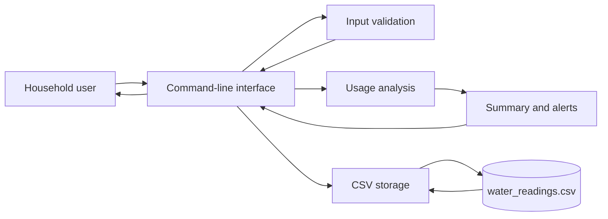
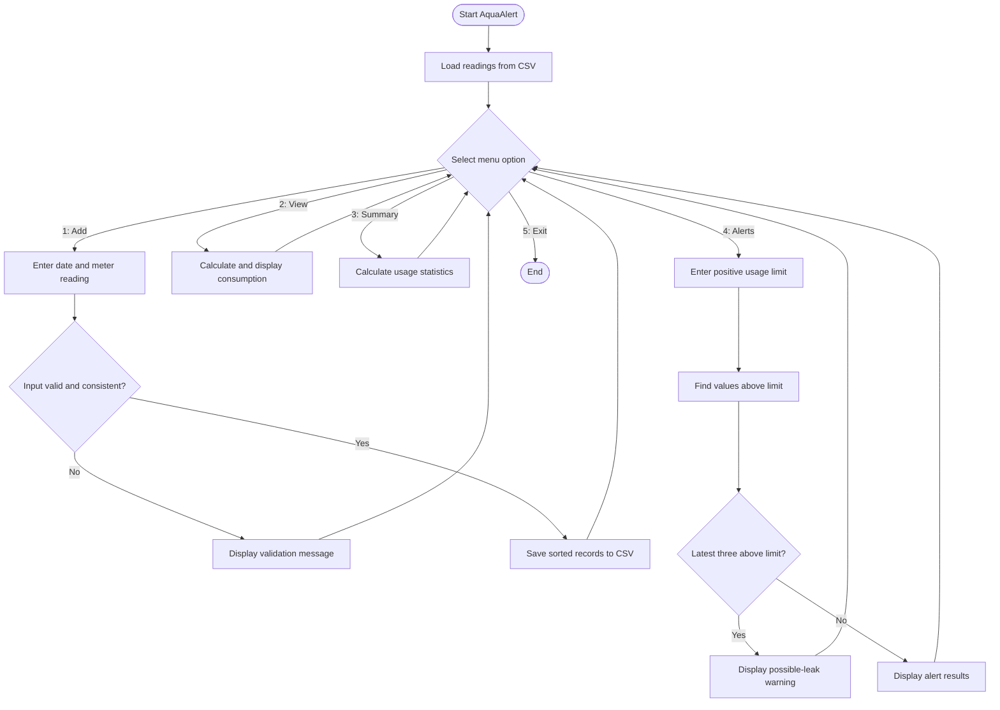
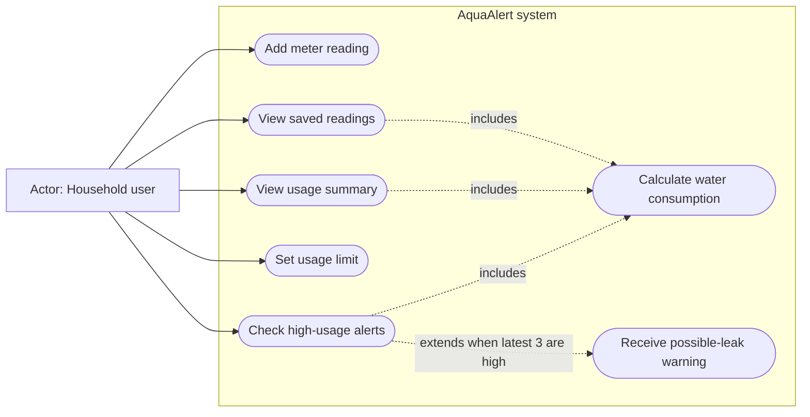
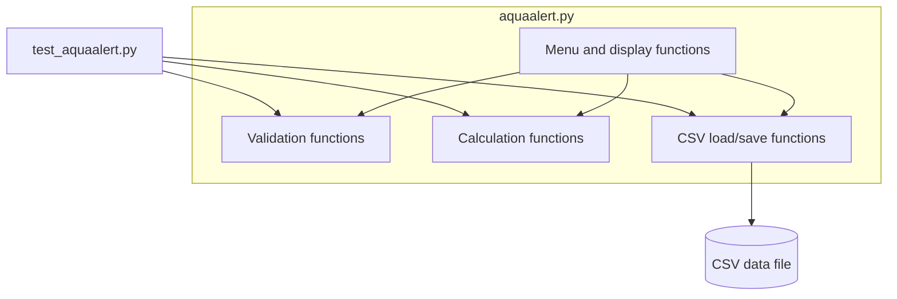

# AquaAlert Design Document

## 1. Problem statement

Households may use more water than expected because of changed habits, taps
left running, or plumbing leaks. The problem often remains unnoticed until a
bill arrives. AquaAlert addresses this problem by storing cumulative meter
readings, calculating consumption between readings, and identifying values that
exceed a user-selected limit.

The system is an awareness and early-warning tool. It does not replace a water
meter inspection or professional plumbing assessment.

## 2. Objectives

- Accept and validate dated cumulative meter readings.
- Store readings so that they remain available after the program exits.
- Calculate consumption from consecutive readings.
- Present understandable summary statistics.
- Identify readings that exceed a chosen usage limit.
- Detect a continuing high-usage pattern in the latest three records.
- Remain simple enough to run and evaluate entirely from a terminal.

## 3. Scope

### In scope

- One household
- Manual entry of readings in litres
- Local CSV storage
- Terminal-based interaction
- Summary and threshold-based alerts

### Out of scope

- Automatic smart-meter or IoT integration
- Cloud accounts or remote data synchronization
- Exact diagnosis of plumbing leaks
- Water-bill tariff calculation
- Graphical user interface

## 4. Functional requirements

| ID | Requirement | Acceptance condition |
|---|---|---|
| FR-01 | Accept a date and cumulative reading. | A valid record is saved to CSV. |
| FR-02 | Validate the date. | Invalid or impossible dates are rejected. |
| FR-03 | Validate the meter value. | Non-numeric and negative values are rejected. |
| FR-04 | Prevent duplicate dates. | A second record for the same date is rejected. |
| FR-05 | Enforce cumulative reading order. | A value inconsistent with adjacent records is rejected. |
| FR-06 | Calculate interval consumption. | Current reading minus previous reading is displayed. |
| FR-07 | Generate a usage summary. | Total, average, minimum, maximum, and monthly estimate are shown. |
| FR-08 | Accept a positive usage limit. | Zero, negative, and non-numeric limits are rejected. |
| FR-09 | Display high-usage records. | Every usage value above the limit is listed. |
| FR-10 | Detect continuing high usage. | A warning appears when the latest three records exceed the limit. |
| FR-11 | Persist records. | Saved readings remain available after restart. |
| FR-12 | Allow clean termination. | Menu option 5 exits without an error. |

## 5. Non-functional requirements

| ID | Category | Requirement |
|---|---|---|
| NFR-01 | Usability | Menu labels and error messages shall use simple language. |
| NFR-02 | Portability | The program shall run on Windows, macOS, and Linux with Python 3.9+. |
| NFR-03 | Performance | Menu operations should complete within one second for 10,000 local records on a typical student computer. |
| NFR-04 | Reliability | Invalid input shall not terminate the application or corrupt saved records. |
| NFR-05 | Maintainability | Calculation, validation, storage, and interface logic shall use separate functions. |
| NFR-06 | Testability | Core functions shall be callable without the interactive menu. |
| NFR-07 | Privacy | Data shall remain local and shall not be transmitted. |
| NFR-08 | Recoverability | Stored data shall be human-readable and recoverable from CSV. |

## 6. System architecture diagram



The command-line interface receives choices and values. Validation checks data
before the storage component writes to CSV. The analysis component converts
consecutive readings into consumption records and returns summaries or alerts.

## 7. Process flow / workflow diagram



## 8. UML use case diagram



## 9. UML component diagram

A component diagram is more suitable than a class diagram because the program
uses functions and dictionaries rather than custom classes.



## 10. Data design

| Field | Type | Example | Rule |
|---|---|---|---|
| `date` | ISO-format string | `2026-09-24` | Valid and unique |
| `meter_reading` | Non-negative decimal | `15420.5` | Cumulative and non-decreasing |

Calculated usage is not stored because it can be reproduced from the original
readings.

## 11. Algorithm design

### Consumption calculation

1. Sort readings by date.
2. Start from the second reading.
3. Subtract the previous cumulative value from the current value.
4. Associate the result with the current date.
5. Repeat for all consecutive pairs.

Sorting is **O(n log n)** and the calculation loop is **O(n)**.

### Possible-leak rule

1. Obtain a positive limit from the user.
2. Select the latest three consumption records.
3. Check whether all three values exceed the limit.
4. Display a warning when the condition is true.

## 12. Evaluation methodology

### 12.1 Functional testing

Run the tests using:

```bash
python3 -m unittest -v
```

| Test ID | Input or condition | Expected outcome |
|---|---|---|
| T-01 | Readings 1000 and 1250 | Usage is 250 litres |
| T-02 | Three usage values above 200 | Possible-leak result is true |
| T-03 | Existing date entered again | Reading is rejected |
| T-04 | Cumulative value below previous value | Reading is rejected |
| T-05 | Save and reload records | Loaded records equal saved records |
| T-06 | Fewer than two readings | Summary is not generated |
| T-07 | Invalid date such as 2026-02-30 | Date is rejected |
| T-08 | Limit equal to or below zero | Limit is rejected |

### 12.2 Accuracy evaluation

Prepare readings and calculate their expected consumption manually. Compare
those values with the program output using these measures:

- **Usage error:** expected usage minus program output; target is 0.
- **Alert correctness:** correctly classified prepared cases divided by all
  prepared cases; target is 100% for the defined threshold rule.
- **Persistence correctness:** saved and reloaded records must match exactly.

### 12.3 Usability evaluation

Ask at least three people unfamiliar with the code to add readings, view usage,
generate a summary, check alerts, and exit. Record completion, errors, and
comments. The target is completion of all five tasks by every participant.

### 12.4 Performance evaluation

Generate a large local dataset and measure loading, sorting, and summary time.
The NFR-03 target is under one second for 10,000 records. Report the test
machine and observed time instead of claiming a result before measurement.

### 12.5 Evaluation limitations

The leak warning evaluates a software rule, not real plumbing accuracy. A field
study using sensors and confirmed leak events would be necessary to measure
real-world detection sensitivity and specificity.
